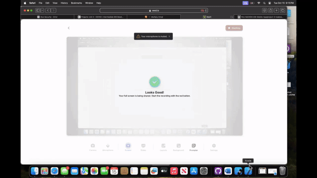

# BeReal PT.2 - Enhanced Social Photo Sharing App

**BeReal PT.2** builds upon the foundation laid in **BeReal Clone PT 1** by adding several engaging features to improve the user experience. In this phase, users can upload personalized photos from their photo albums and share them with friends. The app introduces a time-sensitive feed that encourages active participation—users are unable to see others' posts until they have uploaded their own photo within a 24-hour window. Additionally, posts are enriched with timestamps, locations, and comment sections for better interaction, allowing users to engage with each other's posts meaningfully. The app also features blurred photo previews for posts outside the 24-hour timeframe, maintaining the spontaneity that defines the BeReal experience.

- Developer: Noah Russell
- Development Time: 4 hours
- Technologies Used: Swift, UIKit, Back4App, Xcode

## Features

The following required features have been successfully implemented:

- [✅] User Photo Upload: Users can upload unique photos from their albums and add captions.
- [✅] Post Visibility: Users are unable to see other users' posts until they have uploaded their own photo.
- [✅] Time and Location: Each post includes a timestamp and location data, offering context to the shared moments.
- [✅] 24-Hour Window: The app only displays posts from the last 24 hours relative to the user's last upload, with blurred previews for older posts.

The following optional features are planned for future versions:

- [❌] Comment Section: Users can interact with posts by leaving comments that include the commenter’s username and context.
- [❌] Post Notification: Users receive a notification when it's time to post their photo.

## Future Enhancements

Potential future features include:

- [🔲] Push Notifications: Add notifications to remind users to post at the right time, ensuring engagement.
- [🔲] Post Editing: Allow users to edit or delete their posts after uploading them.
- [🔲] Like/Reaction System: Add the ability for users to react to posts with likes or other reactions.
- [🔲] Friend Recommendations: Implement a feature that suggests friends or popular users to follow based on shared interests.

## Setup Instructions

To run the BeReal PT.2 app locally, follow these steps:

1. Clone the Repository:
   - `git clone https://github.com/your-username/BeReal-PT2.git`
   - `cd BeReal-PT2`
2. Open in Xcode:
   - Open the `.xcodeproj` or `.xcworkspace` file in Xcode.
3. Install Dependencies:
   - If using Back4App or other third-party libraries, follow their setup instructions.
4. Build and Run:
   - Select your desired simulator or a physical iOS device.
   - Click the “Run” button in Xcode to build and launch the app.
5. Test:
   - Upload a photo, view posts, and check the time and location data attached to each post.
   - Test the visibility window by uploading multiple posts within 24 hours.

## Video Walkthrough

Here’s a quick demonstration of the app’s core features:

GIF created with VEED.io.

## Development Process

This app was developed using UIKit to provide a clean and responsive interface. The focus was on improving user engagement by ensuring that posts are timely and interactive. Back4App was used to manage user data, posts, and comments. The time-sensitive feed adds an element of urgency to the app, while the location and timestamp features enrich the user experience.

## Challenges Faced

- **Comment Section Implementation:** Implementing the comment section proved to be a challenging task due to difficulties in managing the backend interaction for posting and fetching comments in real-time.
- **24-Hour Feed Logic:** Managing the logic to ensure only posts within a 24-hour window are displayed correctly, with older posts being blurred, required careful handling of timestamps.

## Key Takeaways
- Gained experience with time-sensitive feeds and working with location-based data.
- Improved skills in integrating backend services with real-time features such as comment sections.
- Learned how to manage user data and posts more effectively in a social app environment.

## Technologies Used

- Programming Language: Swift
- Frameworks: UIKit
- Backend: Back4App
- Development Environment: Xcode 14.0+
- Version Control: Git, GitHub

## License

BeReal PT.2 is licensed under the Apache License 2.0.  
You may obtain a copy of the license at:  
http://www.apache.org/licenses/LICENSE-2.0
